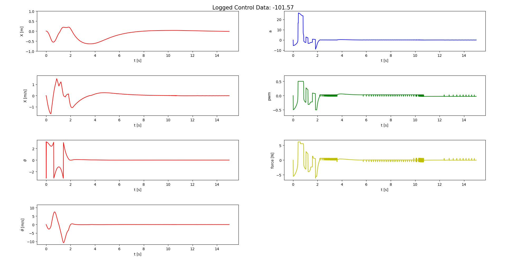

# complex-Pendulum
Complex-Pendulum is a detailed gym environment of the inverted pendulum RL environment. 
It aims at modelling real-world pendulum systems as accurate as possible.

```
Currently under construction.
```

## Installation
This repo was written using Python3.11 with conda on Arch Linux 
and Ubuntu 20.04. Compatibilities with other OS should be feasible 
out of the box, but without guarantee.

### Conda
First install conda. 
For Ubuntu 20.04 read 
[here](https://linuxize.com/post/how-to-install-anaconda-on-ubuntu-20-04/) for Information and Installation Instructions. 
For Arch Linux read [here](https://docs.anaconda.com/anaconda/install/linux/).

### complex-Pendulum
```bash
$ git clone https://github.com/eislerMeinName/complexPendulum.git
$ conda env create -f environment.yml
$ conda activate complexPendulum
```
Then test installation via:
```bash
$ python3 test.py
```
Now you should see a gui with a Pendulum swinging up to the unstable equilibrium.


## Environment
The ComplexPendulum environment is multimodal, and uses a logger class.
```python
>>> from PendelEnv import ComplexPendulum
>>> env = ComplexPendulum(
>>>     frequency: float,                               #control frequency
>>>     episode_len: float,                             #episode length
>>>     path: str,                                      #path to parameter file
>>>     Q: np.ndarray,                                  #Q matrix
>>>     R: np.ndarray,                                  #R matrix
>>>     gui: bool = False,                              #use GUI
>>>     actiontype: ActionType = ActionType.DIRECT,     #Defines ActionSpace
>>>     rewardtype: RewardType = RewardType.LQ,         #Defines RewardFunction
>>>     s0: np.array = None,                            #starting state
>>>     friction: bool = True,                          #use static friction
>>>     log: bool = True)                               #log step response
````
### XML-Parameter
If you want to specify different kinematic parameters of a pendulum, edit params.xml file
or write a new XML file as input to the environment.

| parameter |                                  explanation                                   | standard value |
|----------:|:------------------------------------------------------------------------------:|:--------------:|
|        mp |                             Mass of pendulum [kg]                              |      0.09      |
|         l | Distance between the mounting point and the center of mass of the pendulum [m] |     0.2376     |
|         J |                           Moment of inertia  [kg m2]                           |   7.3404e-3    |
|         m |                                Total mass [kg]                                 |     0.8633     |
|        fp |               Friction coefficient for the pendulum [N m s/rad]                |   2.5014e-4    |
|        fc |                   Friction coefficient for the cart [N s/m]                    |      0.5       |
|         g |                       Gravitational acceleration [m/s2]                        |      9.81      |
|         M |                          PWM to Force coefficient [N]                          |  11.70903084   |
|        Fs |                        Static Friction coefficient [N]                         |  0.292725771   |

### ActionTypes
The ActionType models the action of the agent.


|  type  | dim |    explanation     |
|:------:|:---:|:------------------:|
| Direct |  1  | directly apply pwm |
| Gain   |  4  |    apply gain      |

### RewardTypes
The RewardTypes specify the reward function of the environment.
LQ models a linear quadratic reward function.
EXP models an exponential reward function.

### Logger
The logger logs the current step response and may plot it using matplotlib.
You can also write the data to a csv file.




## Evaluator

### EvaluationDataType

### SetupType

### EvalSetup
