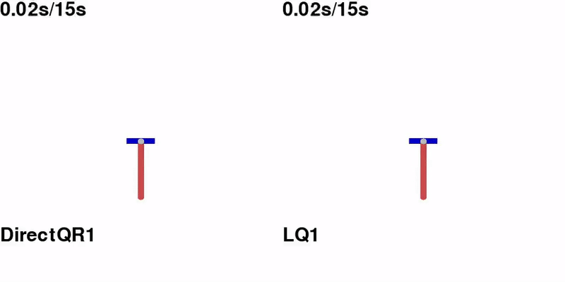
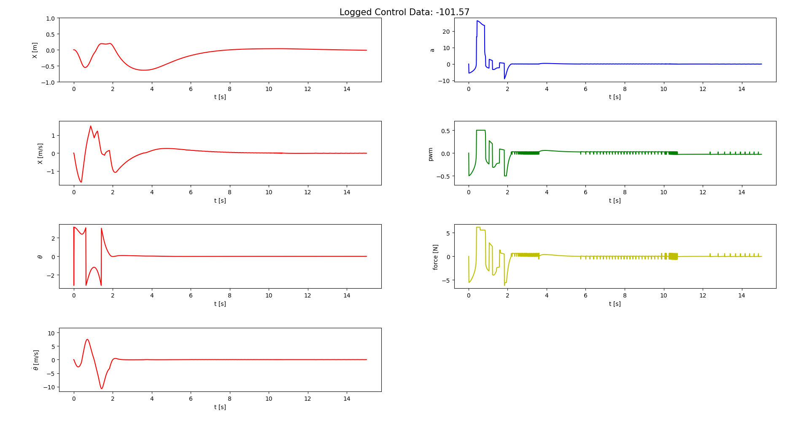

# complexPendulum
ComplexPendulum is a detailed gym environment of the inverted pendulum RL environment. 
It aims at modelling real-world pendulum systems as accurate as possible including static friction.


> ### CAN YOU BE BETTER THAN LQ CONTROL SYNTHESIS???


<p align="center">
  
</p>


## Installation
This repo was written using Python3.10 with conda on Arch Linux 
and Ubuntu 20.04, 24.04. Compatibilities with other OS should be feasible 
out of the box, but without guarantee.

### Conda
First install conda. 
For Ubuntu 20.04 read 
[here](https://linuxize.com/post/how-to-install-anaconda-on-ubuntu-20-04/) for Information and Installation Instructions. 
For Arch Linux read [here](https://docs.anaconda.com/anaconda/install/linux/).

### complex-Pendulum
```bash
$ conda create -n complexPendulum python=3.10
$ conda activate complexPendulum
$ git clone https://github.com/eislerMeinName/complexPendulum.git
$ cd complexPendulum/
$ pip3 install --upgrade pip
$ pip3 install -e .
```
Then test installation via:
```bash
$ python3 test.py
```
Now you should see a gui with a Pendulum swinging up to the unstable equilibrium.
You can easily evaluate this step response via:
```bash
$ python3 evaltest.py
```
### Known Problems during Installation
It may be that some used libraries have to be used inside the environment in a different version. In addition, there is a known problem that may occure because GLIBCCXX is not found in the conda environment. This can be fixed by:
```bash
$ ln -sf /usr/lib/libstdc++.so.6 /home/Username/anaconda3/envs/complexPendulum/bin/../lib/libstdc++.so.6
```

## Environment
The ComplexPendulum environment is multimodal, and uses a logger class.
An example of use can be found in test.py.

```python
>>> import gymnasium as gym
>>> env = gym.make('complexPendulum-v0')
```
Overview of Parameters:
```python
>>> env = ComplexPendulum(
>>>     frequency: float,                               #control frequency
>>>     episode_len: float,                             #episode length
>>>     path: str,                                      #path to parameter file
>>>     Q: np.ndarray,                                  #Q matrix
>>>     R: np.ndarray,                                  #R matrix
>>>     gui: bool = False,                              #use GUI
>>>     actiontype: ActionType = ActionType.DIRECT,     #Defines ActionSpace
>>>     rewardtype: RewardType = RewardType.LQ,         #Defines RewardFunction
>>>     s0: np.array = None,                            #starting state
>>>     friction: bool = True,                          #use static friction
>>>     log: bool = True)                               #log step response
```

For Training please use DirectPendulum, GainPendulum, or BaselineGainPendulum environment depending on the desired ActionSpace.

### XML-Parameter
If you want to specify different kinematic parameters of a pendulum, edit params.xml file
or write a new XML file as input to the environment.

| parameter |                                  explanation                                   | standard value |
|----------:|:------------------------------------------------------------------------------:|:--------------:|
|        mp |                             Mass of pendulum [kg]                              |      0.097     |
|        mc |                           Mass of the cart [kg]                                | 0.45           |
|         l | Distance between the mounting point and the center of mass of the pendulum [m] |     0.2545     |
|         J |                           Moment of inertia  [kg m2]                           |   0.0087879    |
|         m |                                Total mass [kg]                                 |     0.82       |
| M1        |   First polynomial coefficient of pwm to force fit.                            | 11.16          |
|M0         | Polynomial offset coefficient of pwm to force fit.                             |-0.22           |
|        ep |       Viscous friction coefficient for the pendulum [N m s/rad]                |   2.19e-4      |
|        ec |                   Friction coefficient for the cart [N s/m]                    |      0.82      |
|muc        | Coulomb friction coefficient of cart                                           |  0.066         |
|mus        | Static friction coefficient multiplied with normal force [N]                   | 0.5            |
|         g |                       Gravitational acceleration [m/s2]                        |      9.81      |
|    qx     |                          Quantization of encoder [m]                           |   5.7373e-5    |
| qt        |                       Quantization of angle resolution                         |   0.001534     |

### ActionTypes
The ActionType models the action of the agent.
- DIRECT: directly apply pwm (dim 1)
- GAIN: apply proportional gain (dim 4) either in [-100, 0] or baselined by proportional controller

### RewardTypes
The RewardTypes specify the reward function of the environment.
- QR models a quadratic reward function.
- EXP models an exponential reward function.

### Logger
The logger logs the current step response and may plot it using matplotlib.
You can also write the data to a csv file.



## Agents
Besides learning an agent via RL, there are a couple of classes containing agents based on classical control engineering.

|    agent     |                             explanation                             |  actiontype  |
|:------------:|:-------------------------------------------------------------------:|:------------:|
| proportional |              General interface for proportional agent.              |     GAIN     |
|      lq      |              Agent based on linear quadratic control.               |     GAIN     |
|   swing-up   |   Agent used to swing up the pendulum by pumping energy into it.    |    DIRECT    |
|   neural     |                     Agent based on neural net.                      | GAIN/DIRECT  |
|   combined   | Combines a swing-up agent and a proportional agent or neural agent. |    DIRECT    |

## Evaluator
The evaluator class evaluates a logged step response on different response chunks,
on undiscounted return evaluation-setups and classic step control loop performance requirements.

### EvaluationDataType
EvaluationDataType is an enum showing which part of the data should be evaluated.
- COMPLETE: The complete step response including swing-up.
- SWING_UP: Only the swing-up.
- STEP: Without swing-up.

### EvalSetup
Describes one evaluation setup: reward function (setupType), name; Q, R, k if needed.

## Learn Script
Learn an agent with a classic RL algorithm and a wide range of possible environment parameters.

## Log Script
Load a learned agent and visualize/ log a step response.

## Evaluation Script
Evaluate a learned agent using the evaluator class on a wide range of reward functions and classic control theory evaluation criteria.

## Video Script
Generate a video of a trajectory threw the environment.

## Parameter Calculation Script
Calculates the necessary parameter for your xml file based on simpler parameters, that are easier to identify.

## Use in Matlab/ Simulink
Just decide on an own training setup, pick the environment matching the desired action space, etc.
Learn your Agent with a stable-baselines3 algorithm. Currently, the neural agent class only support PPO and SAC.
During training you can observe the agent by executing the log script.
After training, evaluating the agent is recommended. At last, save the parameters of your neural agent in a .mat file.
Load your .mat file in the Matlab Init file. Now you can either observe your agent in the Simulink simulation or directly apply it to the real world system.

> ## Citation
> Nothing to cite, yet...
